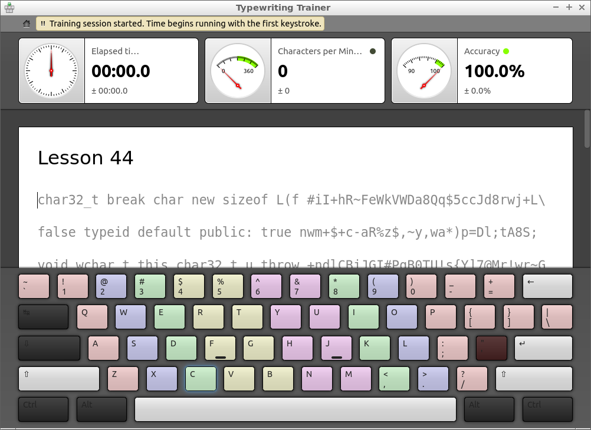
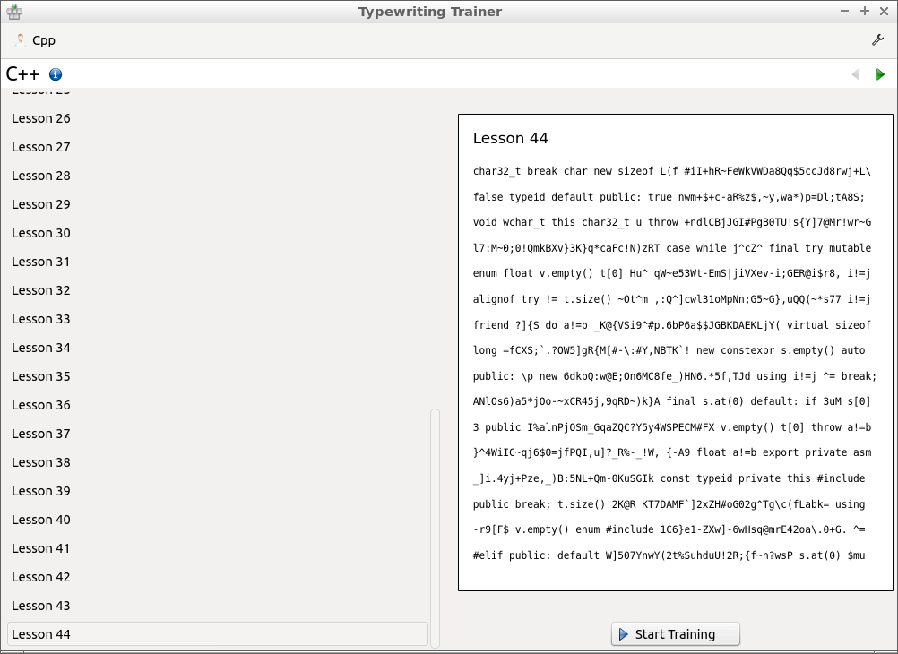
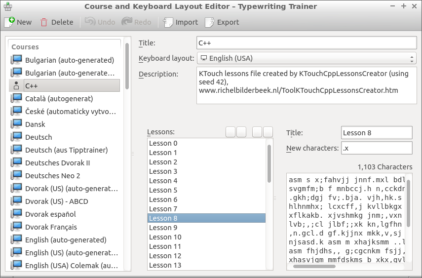

# KTouchCppLessonsCreator

Create C++ lessons for KTouch. In C++, a lot of non-letter characters are used. 
This course builds up similar to a normal course without ignoring symbols
and punctuation.

 * [Download the course file](cpp.xml)

This is how a lesson looks like:

This is how the preview of the course looks like:

This is how it looks like when the course is added to the KTouch courses:

